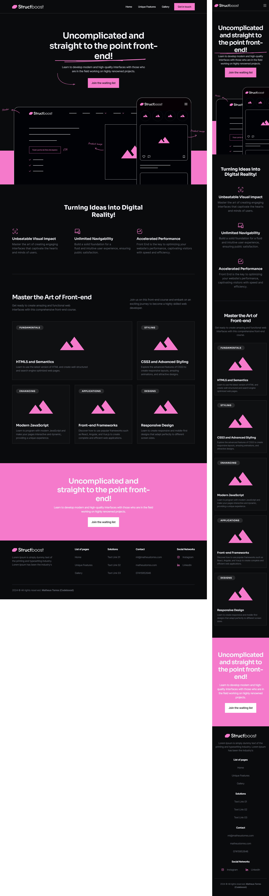

### Structboost: Elevating Web Design to New Heights

Structboost is a modern and innovative web project that aims to provide a high-quality, responsive, and user-friendly interface. The project is designed with a focus on simplicity, elegance, and functionality. It features a variety of components, from a responsive navigation bar to a dynamic post card layout, all of which are designed to provide a seamless user experience.

## Screenshots

  

## Access the online project

<a href="https://matheustorres.com/structboost" target="_blank">matheustorres.com/structboost</a>

## Technologies Used

HTML5
CSS3

## Tools Used

Google Fonts
AOS Animate

## How to Use

To use this project, simply clone the repository to your local machine and open the index.html file in your preferred web browser.

## Installation

1. Clone the repository to your local machine.
2. Navigate to the project directory.
3. Open the index.html file in your web browser.

## Contributions

Contributions are always welcome! If you have any ideas or suggestions to improve the project, feel free to make a pull request or open an issue.

## Contact

Full Name: Matheus Torres 
Email: mt@matheustorres.com 
Website/Portfolio: [https://matheustorres.com](https://matheustorres.com) 
Phone/WhatsApp: +44 07415 952646

I encourage you to share your impressions about any detail of the project that you find unique or especially captivating. I am fully available for an in-depth dialogue about these points and open to collaborating on future projects.
